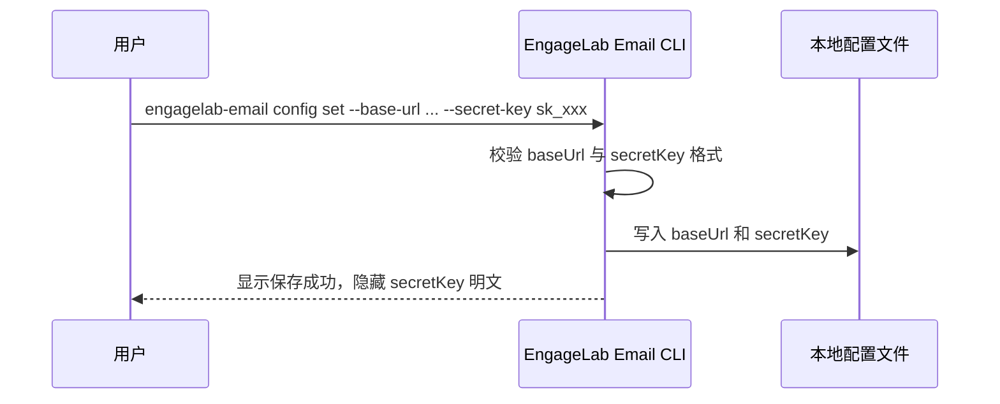
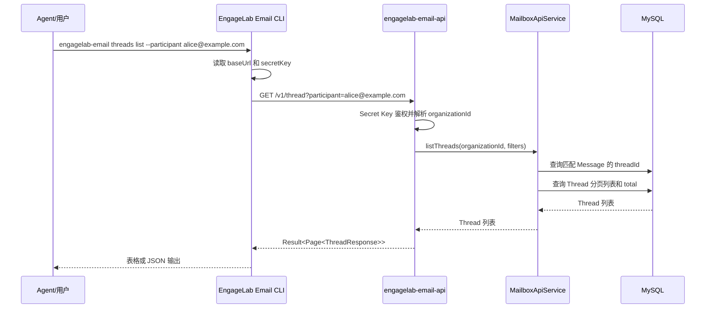
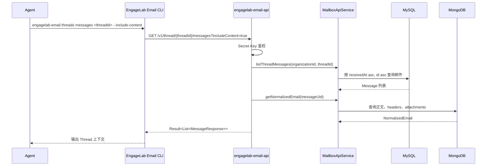
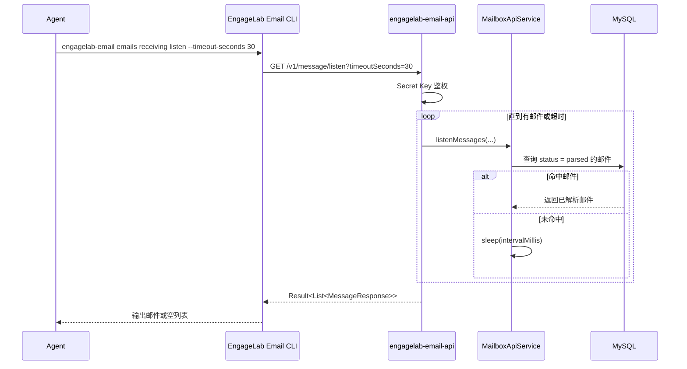
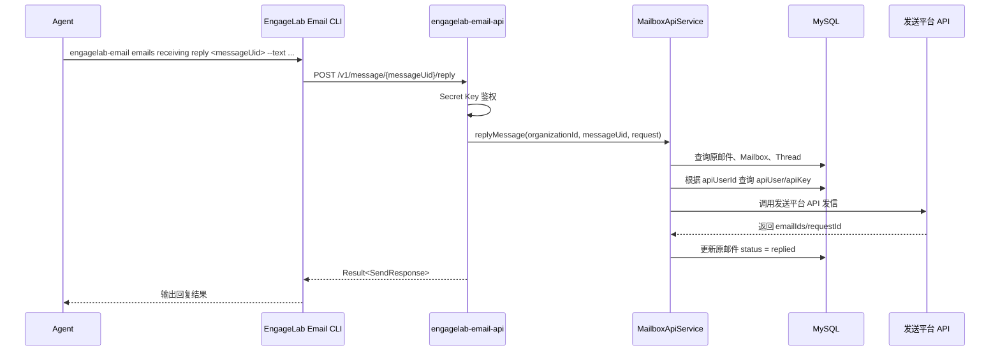
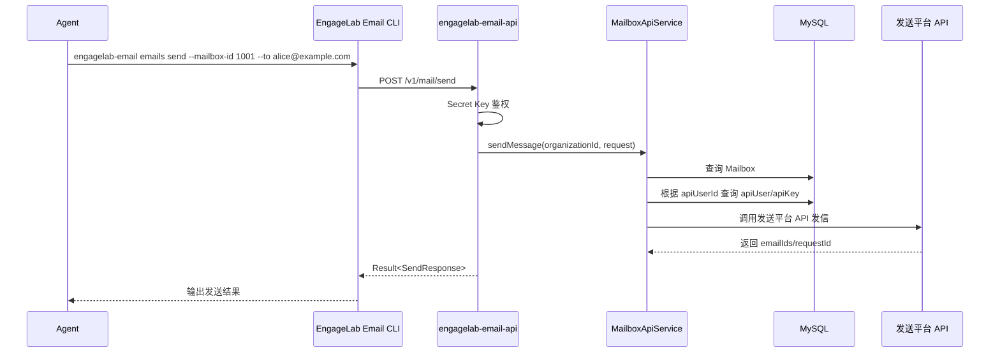

# EngageLab Email CLI 开发文档

## 1. 文档目标

本文档面向 EngageLab Email CLI 开发，说明 CLI 命令设计、每条命令对应的 REST API 调用逻辑，以及核心调用时序

CLI 的一期定位是提供给 Agent/Skill 使用的命令行入口，重点覆盖入站邮件读取、Thread 查询、长轮询消费、邮件回复/发送。Mailbox 管理与 Secret Key 生成仍由页面或内部系统完成，不作为 Agent CLI 的一期能力

命令组织对标 Resend CLI：

- 产品前缀使用 `engagelab-email`
- 发送能力放在 `emails` 命令组下，例如 `engagelab-email emails send`
- 入站能力放在 `emails receiving` 命令组下，例如 `engagelab-email emails receiving listen`
- Thread 是 EngageLab Email 面向会话上下文补充的扩展能力，保留 `threads` 命令组

参考文档：[Resend CLI](https://resend.com/docs/cli)

## 2. 基础约定

### 2.1 Base URL

CLI 通过配置项保存服务地址：

```text
baseUrl = http://{host}:8087
```

所有 REST API 请求都基于该 `baseUrl` 拼接路径

### 2.2 鉴权

Agent CLI 统一使用 Secret Key 鉴权：

```http
Authorization: Bearer <secretKey>
```

Secret Key 解析优先级建议对标 Resend CLI：

1. 命令行参数 `--secret-key`
2. 环境变量 `ENGAGELAB_EMAIL_SECRET_KEY`
3. 本地配置文件

约束：

- Secret Key 固定以 `sk_` 开头
- CLI 不显式传 `orgId`
- 服务端通过 Secret Key 反查 `organizationId`
- CLI 本地只保存 Secret Key 明文，服务端只保存 Secret Key hash
- Agent/CI 场景优先使用环境变量，不建议把 Secret Key 明文写入脚本参数

### 2.3 响应格式

所有 CLI 调用的业务 API 返回 `Result<T>`：

```json
{
  "code": 200,
  "message": "success",
  "data": {}
}
```

分页接口返回 `Result<Page<T>>`：

```json
{
  "code": 200,
  "message": "success",
  "data": {
    "total": 100,
    "list": []
  }
}
```

CLI 处理规则：

- HTTP 状态码非 2xx：直接展示 `message` 并以非 0 退出码结束
- `code != 200`：展示 `message` 并以非 0 退出码结束
- `data == null`：按空结果处理
- JSON 解析失败：提示服务端响应格式非法

## 3. CLI 配置

### 3.1 `engagelab-email config set`

功能：保存 CLI 本地配置，不调用 REST API

示例：

```bash
engagelab-email config set --base-url http://localhost:8087 --secret-key sk_xxx
```

本地配置建议：

```json
{
  "baseUrl": "http://localhost:8087",
  "secretKey": "sk_xxx"
}
```

实现要求：

- Secret Key 不打印明文
- `config list` 展示时只展示前缀，例如 `sk_abcd****`
- 配置文件权限建议限制为当前用户可读写

### 3.2 `engagelab-email config list`

功能：展示 CLI 当前配置，不调用 REST API

示例：

```bash
engagelab-email config list
```

输出建议：

```text
baseUrl: http://localhost:8087
secretKey: sk_R2tQfAk3****
```

## 4. 命令与 REST API 映射

### 4.1 `engagelab-email threads list`

功能：查询 Thread 列表

REST API：

```http
GET /v1/thread
Authorization: Bearer <secretKey>
```

CLI 参数映射：

| CLI 参数 | REST Query | 类型 | 必填 | 说明 |
| --- | --- | --- | --- | --- |
| `--mailbox-id` | `mailboxId` | long | 否 | 按 Mailbox 过滤 |
| `--status` | `status` | integer | 否 | Thread 状态 |
| `--subject` | `subject` | string | 否 | 按归一化主题模糊搜索 |
| `--participant` | `participant` | string | 否 | 按参与人搜索 |
| `--start-time` | `startTime` | string | 否 | 最新邮件开始时间，ISO DateTime |
| `--end-time` | `endTime` | string | 否 | 最新邮件结束时间，ISO DateTime |
| `--page-no` | `pageNo` | integer | 否 | 默认 1 |
| `--page-size` | `pageSize` | integer | 否 | 默认 20 |
| `--json` | 无 | boolean | 否 | 原样输出 JSON |

示例：

```bash
engagelab-email threads list \
  --mailbox-id 1001 \
  --subject refund \
  --participant alice@example.com \
  --page-no 1 \
  --page-size 20
```

调用逻辑：

1. 读取本地 `baseUrl` 与 `secretKey`
2. 将 CLI 参数转换为 Query 参数
3. 发送 `GET {baseUrl}/v1/thread`
4. 校验 `Result.code == 200`
5. 默认以表格展示 `data.list`
6. 如果指定 `--json`，原样输出响应 JSON

默认表格字段：

| 字段 | 来源 |
| --- | --- |
| Thread ID | `threadId` |
| Subject | `subject` |
| Participants | `participants` |
| Last Message | `lastMessageAt` |
| Count | `messageCount` |
| Status | `status` |

### 4.2 `engagelab-email threads get`

功能：查询 Thread 详情

REST API：

```http
GET /v1/thread/{threadId}
Authorization: Bearer <secretKey>
```

CLI 参数映射：

| CLI 参数 | REST 参数 | 类型 | 必填 | 说明 |
| --- | --- | --- | --- | --- |
| `<thread-id>` | Path `threadId` | string | 是 | Thread ID |
| `--json` | 无 | boolean | 否 | 原样输出 JSON |

示例：

```bash
engagelab-email threads get b0d9d6a1-1d17-4df8-8245-c807d7e8cb50
```

调用逻辑：

1. 校验 `<thread-id>` 非空
2. 发送 `GET {baseUrl}/v1/thread/{threadId}`
3. 校验 `Result.code == 200`
4. 默认展示 Thread 概览，包括 `subject`、`participants`、`lastMessageAt`、`messageCount`
5. 如果指定 `--json`，原样输出响应 JSON

### 4.3 `engagelab-email threads messages`

功能：查询指定 Thread 下的邮件列表

REST API：

```http
GET /v1/thread/{threadId}/messages
Authorization: Bearer <secretKey>
```

CLI 参数映射：

| CLI 参数 | REST Query | 类型 | 必填 | 说明 |
| --- | --- | --- | --- | --- |
| `<thread-id>` | Path `threadId` | string | 是 | Thread ID |
| `--limit` | `limit` | integer | 否 | 默认 50 |
| `--include-content` | `includeContent` | boolean | 否 | 是否返回正文和附件 |
| `--json` | 无 | boolean | 否 | 原样输出 JSON |

示例：

```bash
engagelab-email threads messages b0d9d6a1-1d17-4df8-8245-c807d7e8cb50 --include-content
```

调用逻辑：

1. 校验 `<thread-id>` 非空
2. 发送 `GET {baseUrl}/v1/thread/{threadId}/messages`
3. Query 中传入 `limit` 与 `includeContent`
4. 默认按 `sequenceNo` 顺序展示邮件摘要
5. 如果指定 `--include-content`，展示或输出 `text/html/attachments`

### 4.4 `engagelab-email emails receiving list`

功能：查询入站邮件列表

REST API：

```http
GET /v1/message
Authorization: Bearer <secretKey>
```

CLI 参数映射：

| CLI 参数 | REST Query | 类型 | 必填 | 说明 |
| --- | --- | --- | --- | --- |
| `--mailbox-id` | `mailboxId` | long | 否 | 按 Mailbox 过滤 |
| `--status` | `status` | integer | 否 | 邮件解析状态 |
| `--keyword` | `keyword` | string | 否 | 搜索发件人、目标地址、主题、Message-ID、Thread ID |
| `--page-no` | `pageNo` | integer | 否 | 默认 1 |
| `--page-size` | `pageSize` | integer | 否 | 默认 20 |
| `--json` | 无 | boolean | 否 | 原样输出 JSON |

示例：

```bash
engagelab-email emails receiving list --keyword refund --status 2
```

调用逻辑：

1. 读取本地配置
2. 发送 `GET {baseUrl}/v1/message`
3. 校验 `Result.code == 200`
4. 默认以表格展示 `data.list`
5. 如果指定 `--json`，原样输出响应 JSON

### 4.5 `engagelab-email emails receiving get`

功能：查询邮件详情，包含 MongoDB 中的解析正文和附件信息

REST API：

```http
GET /v1/message/{messageUid}
Authorization: Bearer <secretKey>
```

CLI 参数映射：

| CLI 参数 | REST 参数 | 类型 | 必填 | 说明 |
| --- | --- | --- | --- | --- |
| `<message-uid>` | Path `messageUid` | string | 是 | 内部邮件 ID |
| `--json` | 无 | boolean | 否 | 原样输出 JSON |

示例：

```bash
engagelab-email emails receiving get 7e2b2de6-14c5-4ef1-a1e2-f4337e4606e2
```

调用逻辑：

1. 校验 `<message-uid>` 非空
2. 发送 `GET {baseUrl}/v1/message/{messageUid}`
3. 校验 `Result.code == 200`
4. 默认展示邮件头、发件人、主题、正文摘要
5. 如果指定 `--json`，原样输出响应 JSON

### 4.6 `engagelab-email emails receiving listen`

功能：长轮询获取已解析的新邮件，对标 Resend CLI 的 `emails receiving listen`

REST API：

```http
GET /v1/message/listen
Authorization: Bearer <secretKey>
```

CLI 参数映射：

| CLI 参数 | REST Query | 类型 | 必填 | 说明 |
| --- | --- | --- | --- | --- |
| `--mailbox-id` | `mailboxId` | long | 否 | 按 Mailbox 监听 |
| `--limit` | `limit` | integer | 否 | 默认 1 |
| `--timeout-seconds` | `timeoutSeconds` | integer | 否 | 默认 30，服务端最大 60 |
| `--interval-millis` | `intervalMillis` | integer | 否 | 默认 1000，服务端最小 200 |
| `--json` | 无 | boolean | 否 | 原样输出 JSON |

示例：

```bash
engagelab-email emails receiving listen --mailbox-id 1001 --limit 1 --timeout-seconds 30
```

调用逻辑：

1. 发送 `GET {baseUrl}/v1/message/listen`
2. 服务端查找 `status = parsed` 的已解析邮件
3. 服务端不做 claim，不修改邮件状态
4. CLI 输出命中的邮件
5. 如果返回空列表，说明本次 timeout 内没有新邮件
6. 客户端如需避免重复展示，可在本地维护最近已输出的 `messageUid` 集合或游标

重要约束：

- `listen` 是长轮询，不是永久连接
- 超过 `timeoutSeconds` 后服务端会返回空列表
- CLI 如果要持续监听，需要在客户端循环调用 `listen`
- `listen` 不保证多个 Agent 实例只获取一次同一封邮件
- 如果 Agent 通过 `emails receiving reply` 完成回复，服务端将原邮件 `status` 更新为 `replied`

### 4.7 `engagelab-email emails receiving reply`

功能：基于入站邮件回复发信，适用于 Agent 处理完用户邮件后的自动回复

REST API：

```http
POST /v1/message/{messageUid}/reply
Authorization: Bearer <secretKey>
Content-Type: application/json
```

请求体：

```json
{
  "subject": "Re: Refund request for order 20260611001",
  "text": "您好，您的退款申请已经收到，我们会尽快处理。",
  "html": "<p>您好，您的退款申请已经收到，我们会尽快处理。</p>",
  "cc": ["ops@example.com"],
  "bcc": [],
  "attachments": []
}
```

CLI 参数映射：

| CLI 参数 | REST 参数 | 类型 | 必填 | 说明 |
| --- | --- | --- | --- | --- |
| `<message-uid>` | Path `messageUid` | string | 是 | 要回复的入站邮件 ID |
| `--subject` | body `subject` | string | 否 | 回复主题，不传时服务端可按原主题生成 `Re:` |
| `--text` | body `text` | string | 条件必填 | 纯文本正文，`text/html` 至少一个必填 |
| `--html` | body `html` | string | 条件必填 | HTML 正文，`text/html` 至少一个必填 |
| `--cc` | body `cc` | array | 否 | 抄送地址，可重复传入 |
| `--bcc` | body `bcc` | array | 否 | 密送地址，可重复传入 |
| `--attachment` | body `attachments` | array | 否 | 附件，本期可先不实现 |
| `--json` | 无 | boolean | 否 | 原样输出 JSON |

示例：

```bash
engagelab-email emails receiving reply 7e2b2de6-14c5-4ef1-a1e2-f4337e4606e2 \
  --text "您好，您的退款申请已经收到，我们会尽快处理。"
```

调用逻辑：

1. 校验 `<message-uid>` 非空
2. 校验 `--text` 和 `--html` 至少传一个
3. 发送 `POST {baseUrl}/v1/message/{messageUid}/reply`
4. 服务端根据 `messageUid` 查询原始邮件、Mailbox、Thread
5. 服务端根据 Mailbox 的 `apiUserId` 查询发送平台 `apiUser/apiKey`
6. 服务端根据 Mailbox 的 `dataCenter` 选择发送平台发信 API 域名
7. 服务端调用发送平台发信 API
8. 发信成功后服务端应将原邮件状态更新为 `replied`

服务端响应：

```json
{
  "code": 200,
  "message": "success",
  "data": {
    "messageUid": "7e2b2de6-14c5-4ef1-a1e2-f4337e4606e2",
    "emailIds": ["1447054895514_15555555_32350_1350.sc-10_10_126_221-inbound0$alice@example.com"],
    "taskIds": [],
    "requestId": "reply-request-id"
  }
}
```

### 4.8 `engagelab-email emails send`

功能：直接发送一封新邮件，不依赖某一封入站邮件

REST API：

```http
POST /v1/mail/send
Authorization: Bearer <secretKey>
Content-Type: application/json
```

请求体：

```json
{
  "mailboxId": 1001,
  "to": ["alice@example.com"],
  "subject": "Refund update",
  "text": "您的退款申请已经处理完成。",
  "html": "<p>您的退款申请已经处理完成。</p>",
  "cc": [],
  "bcc": [],
  "attachments": []
}
```

CLI 参数映射：

| CLI 参数 | REST 参数 | 类型 | 必填 | 说明 |
| --- | --- | --- | --- | --- |
| `--mailbox-id` | body `mailboxId` | long | 是 | 用于确定发件身份与发送平台凭证 |
| `--to` | body `to` | array | 是 | 收件人，可重复传入 |
| `--subject` | body `subject` | string | 是 | 邮件主题 |
| `--text` | body `text` | string | 条件必填 | 纯文本正文，`text/html` 至少一个必填 |
| `--html` | body `html` | string | 条件必填 | HTML 正文，`text/html` 至少一个必填 |
| `--cc` | body `cc` | array | 否 | 抄送地址，可重复传入 |
| `--bcc` | body `bcc` | array | 否 | 密送地址，可重复传入 |
| `--attachment` | body `attachments` | array | 否 | 附件，本期可先不实现 |
| `--json` | 无 | boolean | 否 | 原样输出 JSON |

示例：

```bash
engagelab-email emails send \
  --mailbox-id 1001 \
  --to alice@example.com \
  --subject "Refund update" \
  --text "您的退款申请已经处理完成。"
```

调用逻辑：

1. 校验 `--mailbox-id`、`--to`、`--subject`
2. 校验 `--text` 和 `--html` 至少传一个
3. 发送 `POST {baseUrl}/v1/mail/send`
4. 服务端根据 `mailboxId` 查询 Mailbox
5. 服务端根据 Mailbox 的 `apiUserId` 查询发送平台 `apiUser/apiKey`
6. 服务端根据 Mailbox 的 `dataCenter` 选择发送平台发信 API 域名
7. 服务端调用发送平台发信 API
8. 服务端返回发送平台消息 ID 和发送状态

服务端响应：

```json
{
  "code": 200,
  "message": "success",
  "data": {
    "emailIds": ["1447054895514_15555555_32350_1350.sc-10_10_126_221-inbound0$alice@example.com"],
    "taskIds": [],
    "requestId": "send-request-id"
  }
}
```

## 5. 调用时序逻辑图

### 5.1 初始化配置



### 5.2 查询 Thread 列表



### 5.3 查询 Thread 邮件上下文



### 5.4 长轮询新邮件



### 5.5 回复入站邮件



### 5.6 直接发送邮件



## 6. 状态与退出码

### 6.1 状态映射

Message status：

| 值 | CLI 展示 | 含义 |
| --- | --- | --- |
| `0` | `received` | 已接收原始邮件 |
| `1` | `parsing` | 解析中 |
| `2` | `parsed` | 解析成功 |
| `3` | `parse_failed` | 解析失败 |
| `4` | `replied` | 已回复 |

### 6.2 退出码

| 退出码 | 场景 |
| --- | --- |
| `0` | 调用成功 |
| `1` | 参数错误或配置缺失 |
| `2` | 鉴权失败 |
| `3` | 资源不存在 |
| `4` | 状态冲突，例如重复回复或邮件状态不允许回复 |
| `5` | 服务端错误或网络错误 |

## 7. 实现建议

### 7.1 HTTP 客户端封装

建议封装统一请求函数：

```text
request(method, path, query, body)
```

职责：

- 拼接 `baseUrl + path`
- 注入 `Authorization: Bearer <secretKey>`
- 将 CLI 参数转换为 Query 参数
- 解析 `Result<T>`
- 统一处理 HTTP 错误、业务错误和网络错误

### 7.2 输出模式

CLI 应支持两种输出模式：

- 默认表格模式：便于人直接查看
- `--json` 模式：便于 Agent/脚本解析

Agent/Skill 集成时应优先使用 `--json`

### 7.3 listen 循环模式

一期 REST API 只提供单次长轮询。CLI 如需持续监听，可在客户端实现循环：

```text
while true:
  messages = listen(timeoutSeconds)
  if messages is empty:
    continue
  for message in messages:
    print message as json
```

不建议 CLI 默认无限循环，建议显式提供后续参数，例如：

```bash
engagelab-email emails receiving listen --watch
```

`--watch` 可以作为二期增强

### 7.4 Agent 调用约定

Agent 使用 CLI 时推荐流程：

1. `engagelab-email emails receiving listen --json`
2. 读取返回的 `messageUid` 与 `threadId`
3. `engagelab-email threads messages <threadId> --include-content --json`
4. Agent 基于完整 Thread 上下文处理
5. 如需回复用户，调用 `engagelab-email emails receiving reply <messageUid> --text ...`
6. 服务端在回复发信成功后更新原邮件 `status = replied`
7. 如果 Agent 只读取邮件但不回复，服务端不额外记录处理结果

## 8. 一期命令清单

| 命令 | REST API | 鉴权 | 说明 |
| --- | --- | --- | --- |
| `config set` | 无 | 无 | 保存本地配置 |
| `config list` | 无 | 无 | 查看本地配置 |
| `threads list` | `GET /v1/thread` | Secret Key | 查询 Thread 列表 |
| `threads get` | `GET /v1/thread/{threadId}` | Secret Key | 查询 Thread 详情 |
| `threads messages` | `GET /v1/thread/{threadId}/messages` | Secret Key | 查询 Thread 邮件上下文 |
| `emails receiving list` | `GET /v1/message` | Secret Key | 查询入站邮件列表 |
| `emails receiving get` | `GET /v1/message/{messageUid}` | Secret Key | 查询入站邮件详情 |
| `emails receiving listen` | `GET /v1/message/listen` | Secret Key | 长轮询获取已解析新邮件 |
| `emails receiving reply` | `POST /v1/message/{messageUid}/reply` | Secret Key | 回复入站邮件 |
| `emails send` | `POST /v1/mail/send` | Secret Key | 直接发送邮件 |
